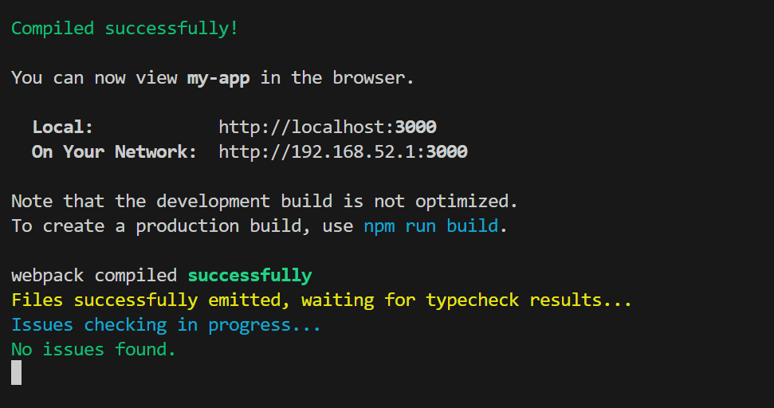
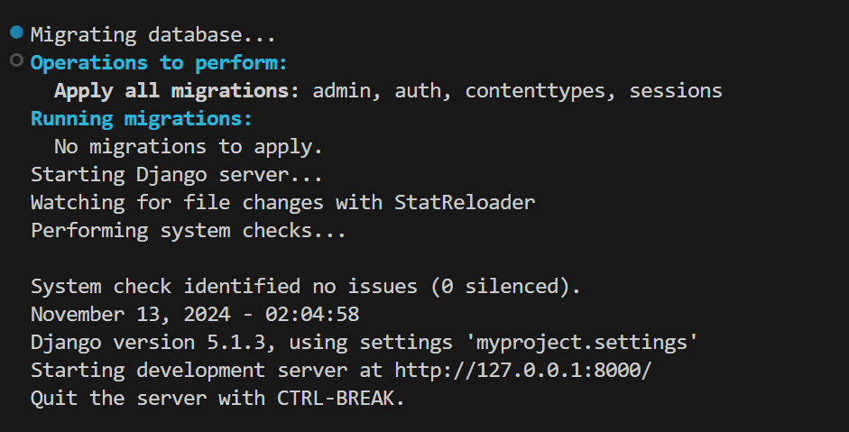
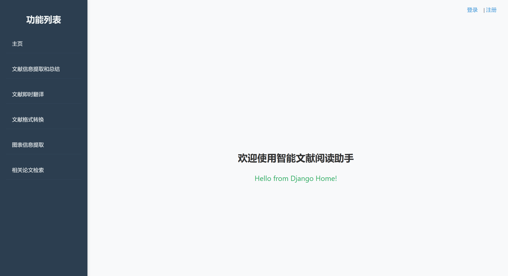

# 说明文档


## 概述

项目地址：https://github.com/lamlgz/LitAssist

前端：my-app/，使用 React+Typescript

后端：my-backend/，使用 Django

## 基础环境搭建

我是 windows

* git clone

* 前端

  ```
  cd my-app
  npm install
  npm start
  ```

  

  

* 后端

  需要新建一个终端
  
  需要激活 venv 的虚拟环境，所以写了个 start.bat，liunx命令有些不同
  
  ```
  cd my-backend
  ./start.bat
  ```
  
  
  
* 网站：收到 Django 发来的 Hello 信息说明前后端连接成功

  


## 分工及对应文件夹

|  成员  |            分工            | 前端（src/compononts/) | 后端            |
| :----: | :------------------------: | ---------------------- | --------------- |
| 李广钊 | 用户界面；文献信息提取总结 | Home/, Summary/        | Home/, Summary/ |
| 袁千皓 |        相关论文检索        | Search/                | Search/         |
| 马争朝 |        图表信息提取        | Chart/                 | Chart/          |
| 廖嘉伟 |        文献格式转换        | Format/                | Format/         |
| 谭君宇 |        文献即时翻译        | Translate/             | Translate/      |

功能尽量在对应文件夹里写，防止冲突。

文献上传不用每个功能都做，在主页面做一个上传就行，上传之后用户可以选择各个功能。

从dev上拉一个自己的分支

